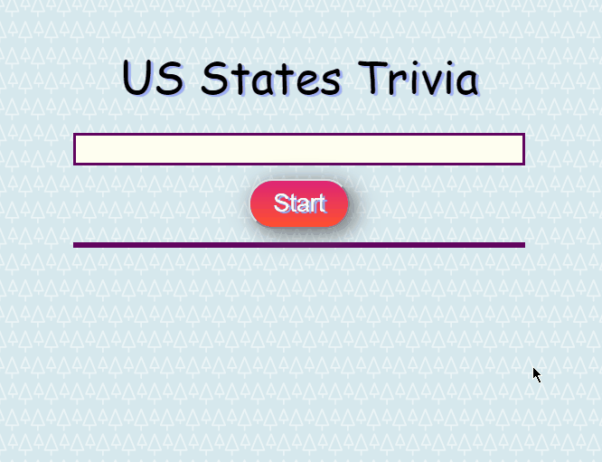

# US States Trivia Game

Flex your trivia skills. Category is US State. 

Instructions:
 Simply press start and wait for questions to appear. When answers are clicked, they are registered and a new question prompted until cofonclusion of all questions.
 Your score will be tallied and displayed when complete. 

## Demo (spoiler alert)

